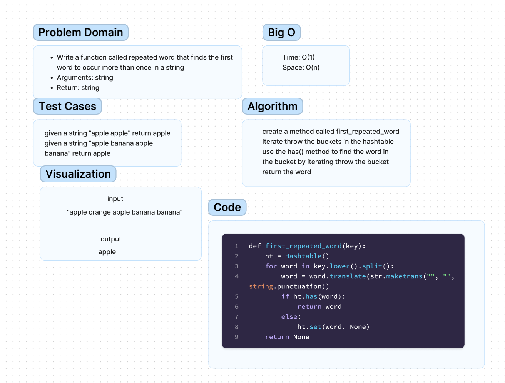

# Challenge Title
Find the first repeated word in a book.

## Whiteboard Process

## Approach & Efficiency
In the beginning I thought this problem was way more complicated then I thought it would be. I was
trying to do everything from scratch.

## Solution
I realized most of the hard work was already done for me from the previous challenge with the has() method.
Once I figure that out it was easier to solve.
