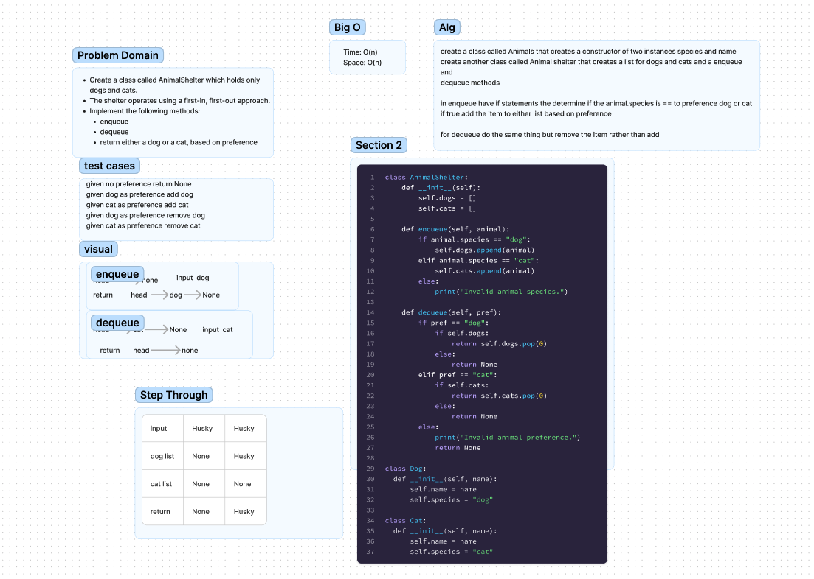

# Code Challenge 12
Create a class called AnimalShelter which holds only dogs and cats.
The shelter operates using a first-in, first-out approach.

## Whiteboard Process

## Approach & Efficiency
Once I understood how each class would work and what information/functions they would have it was what I had to do was straight forward. I Figured that I can append the cat and dog to different list because I did something similar in Lab 11 yesterday with user input.
After that I work through the code one test at a time.

## Solution
Having a name as the value and species as the preference/type was how I got to solving the problem.

