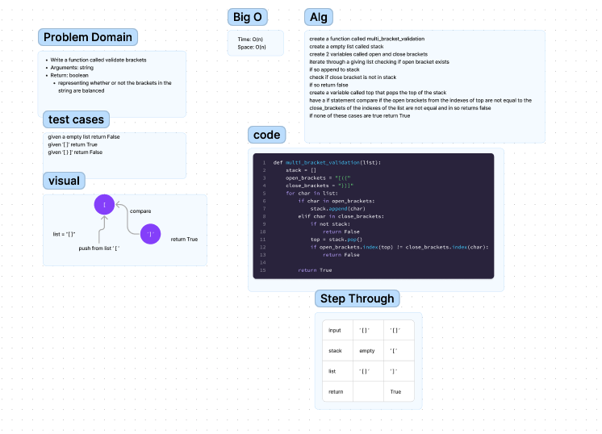

# Code Challenge 12
Write a function called validate brackets
Arguments: string
Return: boolean
representing whether or not the brackets in the string are balanced

## Whiteboard Process

## Approach & Efficiency
The biggest step for me on this code challenge was finding out how to compare the open and closing brackets.

## Solution
I was able to compare and return true for all cases execpt one at the end.

