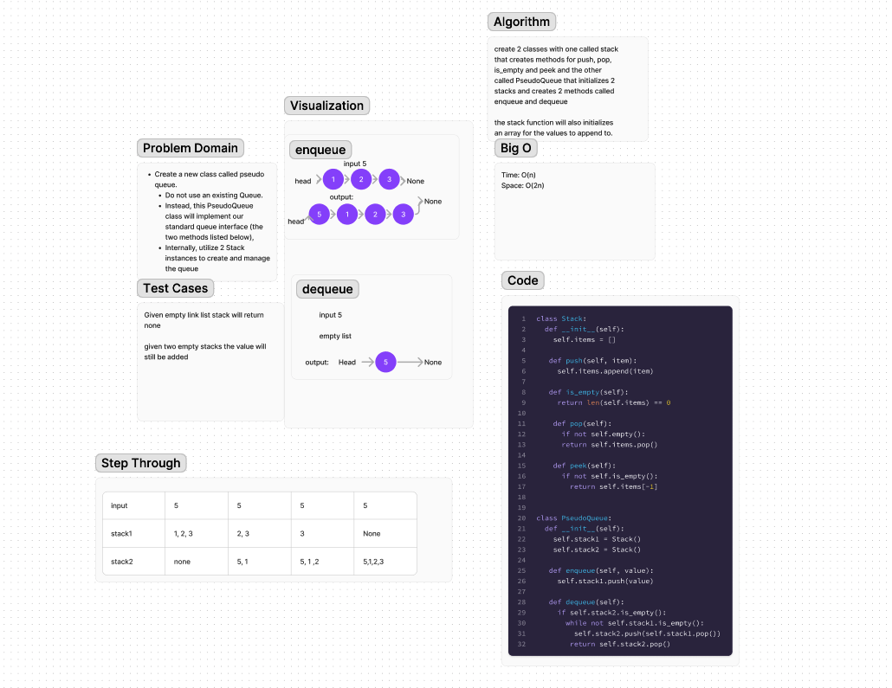

# Code Challenge 11
Create a new class called pseudo queue

## Whiteboard Process

## Approach & Efficiency
Understand how the queue would add and remove from a stack was the first step in my approach.
After that I work through the code one test at a time.

## Solution
The way you run my code is with pytest tests/code_challenges/test_stack_queue_pseudo.py.
All tests should pass.

