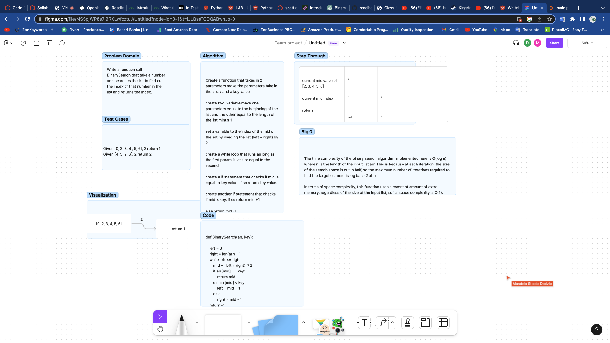

# Code Challenge 1

## WhiteBoard Process

## Approach & Efficiency

We used Chat gpt to get a example code then worked through the problem together to help us understand the code and then worked through the whiteboard with our new understanding

## Solution

The function takes a number and searches the list to find out the index of that number in the list and returns the index.
