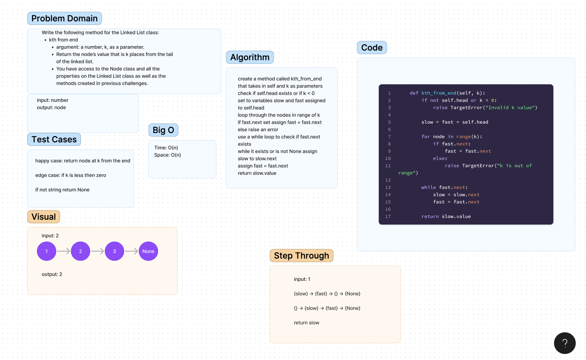

# Challenge Title
k-th value from the end of a linked list.

## WhiteBoard

## Code
[LinkedList](../data_structures/linked_list.py)

## Approach & Efficiency
Figuring out how to get the fast.next to be at the correct node was the most challenging part.

## Solution
Using a for loop to have the fast.next start at the position from range(k).
