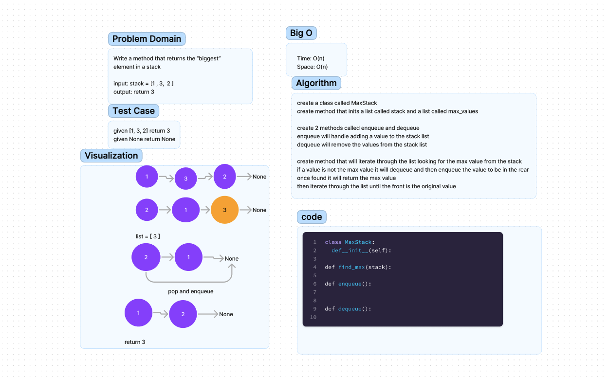

# Challenge Title
Find the Maximum Value in a Binary Tree

## WhiteBoard

## Approach & Efficiency
This challenge was similar to the way the binary tree worked, but I had to figure out how to
track the max_value and I struggle to figure this out for a while.

## Solution
Once I figured out the make the root value the new max_value if the new root value is greater and
check the max_value at the index from the list, I was able to solve it.
